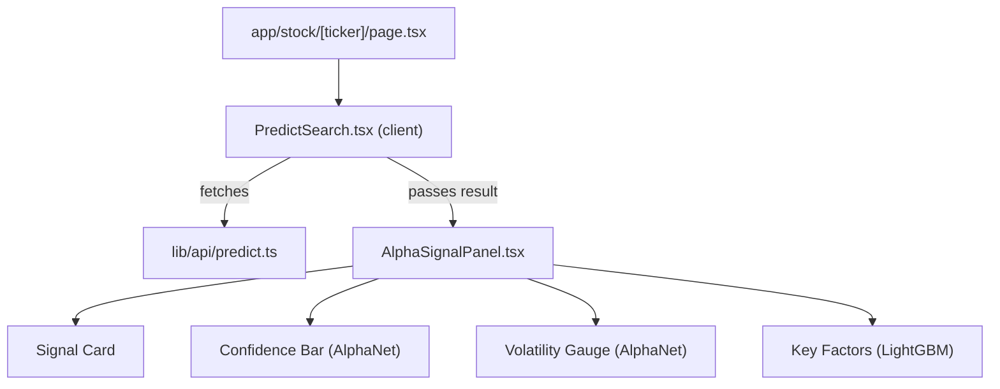

# ML Predict Frontend Dev Plan

## Backend API Contract (reference)

`GET /api/v1/predict/{ticker}?model=alphanet|lgbm`

**AlphaNet response:**

```json
{
  "model": "alphanet",
  "pred_return": 0.023,
  "pred_direction": 0.78,
  "pred_volatility": 0.045,
  "ticker": "AAPL",
  "seq_len": 20,
  "data_points": 120
}
```

**LightGBM response:**

```json
{
  "model": "lgbm",
  "pred_return": 0.015,
  "top_features": [
    { "feature": "rsi_14", "gain": 1234.5 },
    { "feature": "macd_hist", "gain": 987.2 }
  ],
  "ticker": "AAPL",
  "seq_len": 20,
  "data_points": 120
}
```

**Error cases:** 503 (model/data unavailable), 404 (no market data), 400 (insufficient data points)

---

## Files to Create (4 files)

### 1. API Service -- `frontend/lib/api/predict.ts`

- `fetchPrediction(ticker: string, model: "alphanet" | "lgbm"): Promise<PredictResponse>`
- Calls `GET ${API_BASE}/api/v1/predict/${ticker}?model=${model}`
- TypeScript types for both response shapes (`AlphaNetResult`, `LgbmResult`, discriminated union `PredictResponse` on the `model` field)
- Error handling: parse HTTP status, throw typed errors the UI can catch

### 2. Signal Panel -- `frontend/components/AlphaSignalPanel.tsx`

This is the core visual component. It receives the API response as props and renders:

- **Header row**: Ticker badge + model selector toggle (AlphaNet / LightGBM)
- **Signal card**: 5-day predicted return displayed as a percentage with color coding (green for positive, red for negative)
- **Confidence bar** (AlphaNet only): Horizontal progress bar showing `pred_direction` (0-100% bullish probability), with a label like "72% Bullish"
- **Volatility gauge** (AlphaNet only): Small stat card showing predicted 5-day volatility
- **Key Factors table** (LightGBM only): Ranked list of `top_features` with horizontal gain bars, showing which technical indicators drive the prediction
- **Meta footer**: `data_points` used, `seq_len` window size

Uses: Tailwind for layout/styling, `framer-motion` for enter animations, `lucide-react` for icons, `clsx` + `tailwind-merge` via a `cn()` utility (already in the project's deps).

### 3. Ticker Input + Orchestrator -- `frontend/components/StockAnalyzer.tsx\`

- Ticker input field with submit button
- Model toggle: `alphanet` | `lgbm` (default `lgbm`)
- Manages fetch state: idle / loading / error / success
- On submit: calls `fetchPrediction`, passes result down to `AlphaSignalPanel`
- Error state: renders user-friendly message for 503/404/400

### 4. Page Route -- `frontend/app/stock/[ticker]/page.tsx`

- Next.js dynamic route; reads `ticker` from `params`
- Server component shell that renders `PredictSearch` (client component) pre-filled with the URL ticker
- Sets page metadata (title: `{TICKER} - Alpha Signal`)

---

## Component Hierarchy



---

## Key Design Decisions

- **Discriminated union on `model` field**: The two model responses have different shapes. TypeScript narrows the type based on `response.model === "alphanet"` so the panel can conditionally render AlphaNet-specific or LightGBM-specific sections.
- **Client component boundary**: `PredictSearch` is the `"use client"` boundary. The page itself can remain a server component.
- **No global state needed**: The predict flow is self-contained (input -> fetch -> display). React `useState` inside `PredictSearch` is sufficient.
- **Existing deps only**: `framer-motion`, `lucide-react`, `clsx`, `tailwind-merge` are already in `package.json`. No new dependencies required.
